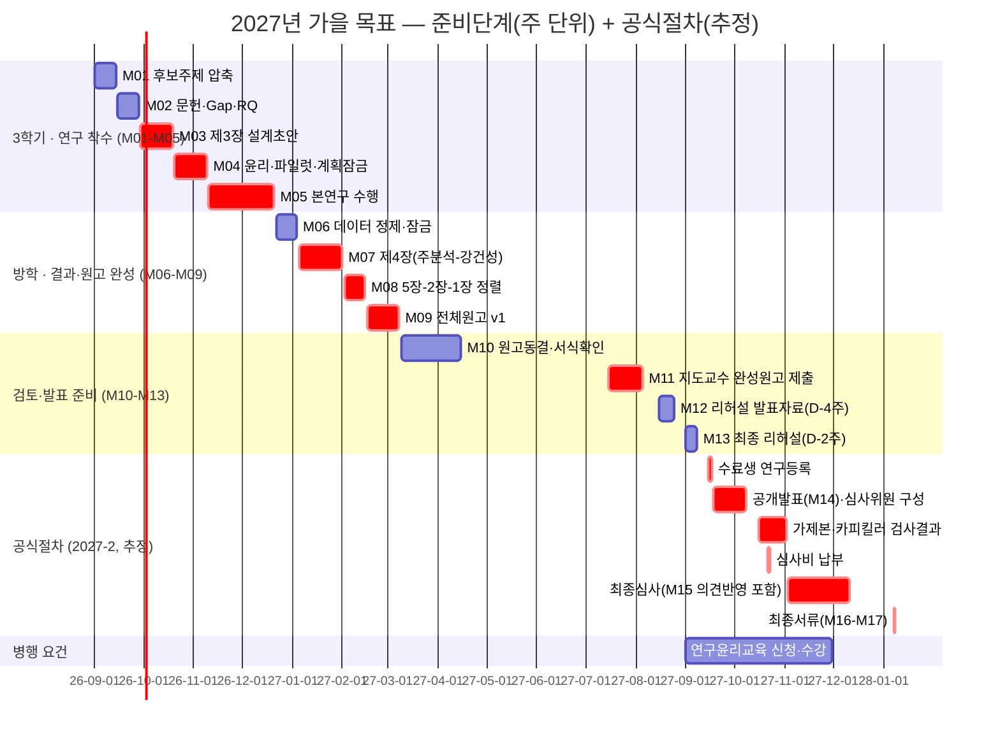

# 예상 논문 일정 — 2027년 가을 목표 (주 단위 간트차트)

이 문서는 두 가지 실제 자료를 근거로 **주(week) 단위까지 고도화**한 일정입니다.

1. `06_논문제출절차와체크리스트.md`에 실은 **2026-2학기(2026년 2학기) 공식 마감 스냅샷** — 오늘(2026-09-21) 기준으로 지금 진행 중인 실제 학기 일정입니다.
2. 학술총무가 제공한 **"신랩 석사 논문가이드 플랫폼"**(로컬 HTML 자료, 내용 검수 기준일 2026-09-05) — 이 랩(신용태 교수 연구실) 자체의 논문 진행 운영표와 주 단위 실행계획(M01~M17)을 담고 있습니다.

## 0. 신랩 LAB 파이프라인 — 입실부터 학술성과까지

일정을 보기 전에, 이 랩이 "논문 한 편"이 아니라 **연구자의 전체 경로**를 어떤 8단계로 관리하는지부터 확인하세요. 아래 단계는 이 문서의 M01~M17, 그리고 [06_논문제출절차와체크리스트.md](06_논문제출절차와체크리스트.md)·[11_심사위원_후보와_구성.md](11_심사위원_후보와_구성.md)가 다루는 각 절차가 전체 경로 중 어디에 해당하는지 보여주는 상위 지도입니다.

| STAGE | 이름 | 핵심 내용 | 이 가이드에서 자세히 다루는 곳 |
|---|---|---|---|
| 01 | 온보딩 | 분야·도구·연구윤리·기록체계 | [30_연구윤리_데이터거버넌스.md](12_단계별_지침_라이브러리/30_연구윤리_데이터거버넌스.md) |
| 02 | 문제정의 | 관심영역 → 문제 → Gap → RQ | [01_연구주제탐색.md](12_단계별_지침_라이브러리/01_연구주제탐색.md), [02_문헌검토_ResearchGap.md](12_단계별_지침_라이브러리/02_문헌검토_ResearchGap.md) |
| 03 | 설계승인 | 모형·데이터·실험·분석계획 | 트랙 폴더(01_실증트랙_경영IS/, 02_실험트랙_공학컴공/)의 방법론 파일 |
| 04 | 연구수행 | 파일럿 → 본 수집·실험 → 로그 | [12_기각실패_데이터부족_일정복구.md](12_단계별_지침_라이브러리/12_기각실패_데이터부족_일정복구.md) |
| 05 | 전체 원고 | 결과 중심으로 전 장 연결 | [15_제1_5장장별집필설계.md](12_단계별_지침_라이브러리/15_제1_5장장별집필설계.md), [16_주장근거_전장정합성감사.md](12_단계별_지침_라이브러리/16_주장근거_전장정합성감사.md) |
| 06 | 공개발표 | 완성 원고 기반 발표·질의응답 | [29_공개발표_심사의견대응.md](12_단계별_지침_라이브러리/29_공개발표_심사의견대응.md) |
| 07 | 심사·제출 | 의견 반영표·형식·최종본 | [06_논문제출절차와체크리스트.md](06_논문제출절차와체크리스트.md), [18_최종원고_제출파일감사.md](12_단계별_지침_라이브러리/18_최종원고_제출파일감사.md) |
| 08 | 성과확장 | 학술대회·학술지·후속연구 | [22_학위논문_학술논문전환.md](12_단계별_지침_라이브러리/22_학위논문_학술논문전환.md) |

이 랩이 명시하는 공통 운영원칙 6가지도 함께 기억해 두면 좋습니다: **권한 구분**(연구방향·방법·범위는 지도교수와 확정하되, 제출자격·심사·학위수여는 공식 절차를 따름) · **회의단위**(구두 설명 대신 1–3쪽 의사결정 문서와 질문목록으로 검토 요청) · **버전관리**(원고·데이터·코드·결과표의 날짜·버전·변경이유 기록) · **증거추적**(RQ–이론–방법–결과–결론을 대응표로 연결) · **품질게이트**(통과기준을 충족하기 전에는 다음 단계의 비용이 큰 작업을 시작하지 않음) · **공식기준**(학교·학과·학회의 당해 학기 공지를 우선하고 링크와 확인일을 기록).

> **신랩 기본원칙**: 공개발표는 미완성 원고를 처음 검토받는 자리가 아닙니다. 전체 원고를 완성하고 본인의 지도교수에게 발표 진행 여부를 확인받은 뒤에 공식 절차에 들어갑니다 — 아래 일정 전체가 이 원칙을 기준으로 역산되어 있습니다.

## 먼저 확인할 것 — 착수 시점이 이전 추정보다 훨씬 이릅니다

이전 버전의 이 문서는 "2027년 1월 주제 확정 시작"을 가정했습니다. 그런데 이 랩 자체 운영표는 **3학기 시작 시점(예: 2026년 9월)부터 곧바로 본격 실행**할 것을 전제로 하며, "공개발표는 미완성 원고를 처음 검토받는 자리가 아니다 — 전체 원고를 완성한 뒤 지도교수 확인을 받고 공식 절차에 들어간다"는 원칙을 명시합니다. 즉 **공개발표(9~10월) 시점에 이미 1~5장 전체 초고가 완성돼 있어야 하는 것을 기본값으로 잡고 있습니다.** 이 문서는 이 랩의 기준에 맞춰 착수 시점을 앞당겨 다시 계산했습니다 — 1월 착수를 이미 계획하셨다면 아래 "일정이 늦게 시작됐다면" 절을 참고하세요.

## 1. 지금 진행 중인 실제 학기 — 2026-2학기 공식 스냅샷

오늘 날짜(2026-09-21) 기준으로 이미 시작된 실제 일정입니다(2026.08.14 일반대학원 공지).

| 단계 | 공식 기간 | 상태(2026-09-21 기준) |
|---|---|---|
| 수료생 연구등록 | 2026.09.15–17 | 이미 지남 |
| 공개발표·심사위원 구성 | 2026.09.18–10.08 | **진행 중** |
| 가제본·카피킬러 검사결과 | 2026.10.16–11.02 | 예정 |
| 심사비 납부 | 2026.10.21–23 | 예정 |
| 최종심사 | 2026.11.03–12.11 | 예정 |
| 최종서류(dCollection 업로드 등) | 2027.01.07–08 | 예정 |

이번 학기에 해당하지 않더라도, 이 표가 "논문학기 공식 절차"의 실제 길이(등록~최종서류 약 16주)를 보여주는 가장 신뢰도 높은 기준입니다.

## 2. 2027년 가을 제출을 목표로 할 때 — 월 단위 개요

신랩 운영표의 "2027년 가을 트라이" 구간입니다. 2학기(재학 2학기)에 지도교수 위촉·논문계획서 제출 등 공식 선행절차를 마쳤다는 전제 위에서, 3학기부터 아래처럼 역산합니다.

| 시기 | 단계 | 핵심 산출물 |
|---|---|---|
| 3학기 · 2026.9–10 | 주제 범위와 연구 가능성 확정 | 문제정의, 핵심 문헌, Gap, 데이터 접근성, 예비 RQ → 지도교수 1차 확인 |
| 2026.11–2027.1 | 제3장 연구설계 작성 | 대상·변수·도구·절차·분석법·윤리를 실행 수준으로 문서화 → 설계 승인 |
| 2027.2–4 | 예비분석 및 본 연구 수행 | 파일럿, 도구 보완, 수집·실험·분석, 분석로그와 결과표 동시 작성 |
| 2027.5–6 | 제4장 결과 및 제5장 결론 | 결과표·그림 완성, RQ별 결론·기여·한계를 결과에 연결 |
| 2027.7–8 | 제2장·제1장 및 전체 원고 완성 | 이론·선행연구 재구성 → 서론·형식·인용·초록·부록 정리 → 공개발표 승인 |
| 2027.9~2028.1(추정) | 공개발표 → 심사 → 최종 제출 | 위 "2026-2 스냅샷"을 1년 이동한 패턴(아래 4절) |

**집필 순서가 1→2→3→4→5가 아니라는 점이 핵심입니다.** 이 랩은 실제 집필·확정 순서를 **3장 → 4장 → 5장 → 2장 → 1장**으로 운영합니다(최종 배열은 통상적인 1→2→3→4→5). 방법을 먼저 확정하고 결과를 낸 다음, 그 결과에 맞춰 이론적 배경과 서론을 마지막에 정렬하는 방식입니다. 이렇게 하면 "서론에서 예고한 것과 결론이 다른" 흔한 문제를 줄일 수 있습니다.

### 집필 순서 전환의 구체적 이유

**제3장부터 시작하는 이유**
- 질문, 대상, 자료, 변수, 도구, 분석방법의 실행 가능성을 먼저 검증
- 연구윤리·자료 접근·표본·실험환경 리스크를 조기에 발견
- 지도교수가 판단할 수 있는 구체적인 설계 문서를 먼저 제시

**제4장 직후 제5장을 작성하는 이유**
- 결과 해석의 근거와 한계를 분석 직후 원고로 고정
- RQ별 결론, 학술적·실무적 기여와 경계조건을 결과표에 직접 연결
- 제3장에서 멈추지 않고 연구의 전체 사이클을 조기에 완성

**제5장 다음 제2장·제1장을 확정하는 이유**
- 실제 결과와 결론을 설명하는 이론·선행연구에 집중
- 제3장의 변수·처치·측정·분석 선택 근거를 제2장과 빠짐없이 연결
- 완성된 차별성과 기여를 기준으로 제1장의 문제·목적·RQ·범위를 최종 정렬

> **주의**: 제1·2장을 나중에 확정한다는 말은 선행연구와 문제정의를 연구 뒤로 미룬다는 뜻이 아닙니다. 초기 초안과 근거자료는 반드시 먼저 준비해 두고, 결과가 나온 뒤 그 초안을 결과에 맞게 다시 정렬하는 것입니다.

## 3. 주 단위 마일스톤 — "OO월 N주차" 예시

아래는 **"3학기가 2026년 9월 1일에 시작한다"고 가정했을 때의 예시**입니다. 실제 학사일정(개강일)에 맞춰 시작일만 바꾸면 나머지는 그대로 활용할 수 있습니다. M-코드는 신랩 운영표의 고정 작업단위 표기를 그대로 따랐습니다. **구분** 열은 원본 간트보드의 범례를 그대로 옮긴 것입니다 — 필수: 필수 임계경로(밀리면 전체 일정이 밀림) · 병행: 병행 지원작업(임계경로와 동시에 처리 가능) · 분기: 실증·실험 분기(트랙에 따라 다른 작업) · 승인: 지도교수 결정·승인(반드시 확인받아야 다음 단계 진행).

| 주차 구간 | 기간(예시) | 구분 | 작업(M-코드) | 지도교수 확인 게이트 |
|---|---|---|---|---|
| 1~2주차 | 9월 1주차 ~ 9월 2주차 (09.01–09.14) | 필수 | **M01** 후보주제 3개 → 1개로 좁히기 | D0 주제 탐색범위 결정 |
| 3~4주차 | 9월 3주차 ~ 9월 4주차 (09.15–09.28) | 병행 | **M02** 핵심문헌·Gap 정리, RQ 1~3개 도출 | D1 문제·Gap·RQ 확정 |
| 5~7주차 | 9월 5주차 ~ 10월 3주차 (09.29–10.19) | 필수 | **M03** 제3장 설계초안(모형/변수 또는 처치/Baseline) | D2 방법·범위·비교기준 결정 |
| 5~7주차(병행) | 09.29–10.19 | 병행 | **윤리·자료·실험환경**: IRB·접근허가·장비·보안을 수집 전에 승인 완료 | D2에 포함해 함께 확인 |
| 8~10주차 | 10월 3주차 ~ 11월 2주차 (10.20–11.09) | 필수 | **M04** 파일럿·프로토콜 잠금(오류수정, 제외·중단기준) | D3 본 연구 착수 승인 |
| 11~16주차 | 11월 2주차 ~ 12월 3주차 (11.10–12.21) | 필수 | **M05** 본 연구 수행(수집·실험), 주간 품질점검 | 범위 변경 시 즉시 재보고 |
| 11~16주차(분기) | 11.10–12.21 | 분기 | **실증 분기**: 척도·표본 → 측정검증 → 주 분석 / **실험 분기**: Baseline·Metric → 반복·Ablation | 트랙에 맞는 방법론 파일 참고 |
| 방학 1~2주차 | 12월 4주차 ~ 익년 1월 1주차 (12.22–01.04) | 병행 | **M06** 데이터 정제·이상치 처리, 최종 자료 잠금(D4) | 분석대상·제외기준 확정 |
| 방학 3~6주차 | 1월 1주차 ~ 2월 1주차 (01.05–02.01) | 필수 | **M07** 제4장 — 주 분석 → 강건성/Ablation, 결과를 즉시 원고화 | 추가분석 범위·중단선 결정 |
| 방학 7주차 | 2월 1주차 (02.02–02.08) | 필수 | **M08A** 제5장 결론(RQ별 결론·학술적/실무적 기여·한계) | 예상 밖 결과 해석 |
| 방학 7~8주차 | 2월 1주차 ~ 2월 2주차 (02.02–02.15) | 필수 | **M08B** 제2장 고도화(결과·결론을 이론·Gap·차별성과 재연결) | 기여 수정범위 확인 |
| 방학 8주차 | 2월 3주차 (02.16–02.22) | 필수 | **M08C** 제1장 확정(문제·목적·RQ·범위·기여 최종 정렬) | 서론 확정 |
| 4학기 1~3주차 | 2월 3주차 ~ 3월 2주차 (02.16–03.08) | 필수 | **M09** 전체 원고 v1(초록·참고문헌·부록 포함, 전 장 수치 일치) | D5 1차 전체원고 검토 |
| 공개발표 D-8주 | 3월 이후 계속 다듬는 구간 | 승인 | **M10** 원고 동결, 서식·표절검사·심사위원 절차 확인 | 공개발표 신청 가능 여부 |
| 공개발표 D-6주 | (2027.9 공개발표 기준 역산) | 필수 | **M11** 지도교수 검토용 완성 원고 제출(미완성 장 없이) | D5 하위 승인선 |
| D-4주 | | 필수 | **M12** 리허설 발표자료(10분 기준: 문제–Gap–방법–증거–기여–한계) | 발표논리·답변수준 확인 |
| D-2주 | | 필수 | **M13** 공식 제한시간으로 최소 2회 리허설, 질문 기록 | 최종 발표자료 확인 |
| 공개발표 당일 | 2027년 9월(추정) | 필수 | **M14** 질의응답 원문 기록(공개발표 자체는 D6 게이트) | 심사의견 우선순위 결정 |
| D+1~7일 | | 필수 | **M15** 심사의견을 수용/부분수용/설명으로 분류·반영표 작성 | D7 추가분석 범위 결정 |
| 최종제출 D-2주 | | 승인 | **M16** 서식·목차·인준·참고문헌·페이지·파일명 전수 대조 | 내용수정 종료선 확정 |
| 최종제출 D-3일 | 2028년 1월 초(추정) | 승인 | **M17** 최종 PDF·서류·데이터 백업, 제출 | D8 지도교수 제출본 확인 |

원본은 M08을 하나의 막대가 아니라 08A(5장)·08B(2장)·08C(1장) 세 칸으로 나누어 표시합니다 — 위 표도 이를 그대로 반영했습니다. **주의**: M10 이후(공개발표 D-8주부터)는 실제 공개발표일이 확정돼야 역산할 수 있습니다. 2026-2학기 패턴(공개발표 시작 9월 18일)을 그대로 1년 이동하면 2027년 9월 18일 전후가 되므로, M09(전체원고 v1, 3월 초 완성)부터 공개발표(9월)까지 **약 6개월의 여유 구간**이 생깁니다 — 이 여유는 그대로 노는 시간이 아니라 지도교수 검토·재분석·형식 정비에 씁니다.

### 3-1. 리허설 슬라이드별 시간 배분 (연구실 연습 기준, 공식 학교 규격 아님)

M12~M13(리허설)을 실제로 어떻게 채우는지의 예시입니다. 리허설 총시간 600초(10분) · 권장 슬라이드 15장 · 장당 평균 40초.

| 슬라이드 | 핵심 내용 | 시간 |
|---|---|---|
| 1 | 제목·한 문장 연구정의 | 20초 |
| 2–3 | 배경·문제·연구 Gap | 70초 |
| 4 | 목적·연구질문 | 40초 |
| 5–6 | 이론·연구모형 | 80초 |
| 7–9 | 대상·자료·분석 절차 | 110초 |
| 10–12 | 핵심 결과 | 150초 |
| 13–14 | 결론·시사점·기여 | 100초 |
| 15 | 한계·마무리 | 30초 |

리허설에서는 8분 30초~9분 20초에 본 발표를 끝내고, 표본 수·핵심 수치·한계 관련 예상 질문의 답변을 별도로 준비해 둡니다. 원문이 명시하는 공식 선행요건도 함께 확인하세요: **"현행 대학원 세칙상 공개발표 요지문은 발표 5일 전까지 제출한다."** 다만 발표시간·자료형식·제출처는 해당 학기 공지와 ITPM 안내로 다시 확인해야 합니다 — 10분·15장은 공식 학교 규격이 아니라 압축 발표 연습을 위한 이 랩의 예시입니다.

## 4. 논문학기 공식 절차 — 2027년 가을 (1년 이동 추정)

2026-2 스냅샷(1절)을 그대로 1년 이동한 값입니다. **실제 공지가 아니라 추정**이며, 확정되면 반드시 교체하세요.

## 5. 일정이 이미 늦게 시작됐다면

오늘(2026-09-21) 기준으로 위 3절의 "1~2주차(9월 1주차)"는 이미 지났습니다. 이 경우 선택지는 둘입니다.

- **목표를 2027년 가을로 유지**: M01~M02(주제·Gap·RQ)를 9월 나머지 기간에 압축해서 진행하고, M03 이후 일정을 그만큼 당겨서 따라잡습니다. 각 단계의 **순서와 선행조건(D0→D1→D2…)은 생략하지 않는 것**이 이 랩 운영 원칙입니다.
- **목표를 2028년 봄으로 미룸**: 신랩 운영표는 3학기 시작을 2027.3–4로 잡는 "2028년 봄 트라이"도 제공합니다(제3장 2027.5–7 → 본연구 2027.8–10 → 4·5장 2027.11–12 → 2·1장 2028.1–2 → 공식절차는 2028-1학기 패턴 적용). 시간이 더 필요하면 이쪽이 무리 없는 선택입니다.

어느 쪽이든 **지도교수와 먼저 상의해서 확정**하세요. 이 표는 판단을 대신하지 않습니다.

## 6. 이 일정을 쓸 때 주의할 점

- 이 표는 "신랩 석사 논문가이드 플랫폼"이라는 랩 자체 운영자료의 구조를 옮긴 것이며, 그 자료 자체도 "공식 일정이 아니라 연구실 역산안"이라고 명시합니다. 학교 공식 일정(1절)과 랩 내부 운영 목표(2~4절)를 구분해서 읽으세요.
- **지도교수 위촉·논문계획서 제출**(재학 2학기, [06_논문제출절차와체크리스트.md](06_논문제출절차와체크리스트.md) 0절)이 끝나 있어야 3학기의 본격 실행이 의미가 있습니다.
- **심사대상 자격요건**(학점·종합시험·연구윤리교육·지도기간, [06_논문제출절차와체크리스트.md](06_논문제출절차와체크리스트.md) 2절)을 3학기 초에 미리 확인하세요.
- **박사·석박사통합과정**은 [04_석사와_박사의_차이.md](04_석사와_박사의_차이.md)의 학회지 게재 요건도 이 준비 기간 안에서 별도로 진행해야 합니다.
- 실증·실험 트랙에 따라 M03·M05·M07의 구체적 내용이 달라집니다: 실증은 척도·표본·모형을 잠그고 신뢰도·타당도→주분석→강건성 순으로, 실험은 Baseline·Metric·반복조건을 잠그고 주요비교→반복검증→Ablation→실패사례 순으로 제4장을 완성합니다.

## 7. 결정 게이트 D0–D8 — 각 M-코드가 어떤 게이트에 해당하는가

3절 표의 "지도교수 확인 게이트" 열에 적은 D0~D8 코드는 이 랩이 정의한 아홉 개(D0~D8, 그리고 POST) 결정 게이트를 가리킵니다. 게이트는 형식적 보고가 아니라 **다음 단계에 큰 시간과 비용을 쓰기 전에 위험을 차단하는 연구실 내부 승인 지점**입니다. 주제·방법·범위·원고·내부 준비도는 본인의 지도교수와 확정하며, **제출자격·심사위원 위촉·합격·학위수여는 현행 규정과 담당부서·심사위원회 절차를 따릅니다** — 게이트 통과가 공식 심사 통과를 의미하지 않습니다.

| 게이트 | 단계 | 산출물 | 통과 기준 | 승인 주체 |
|---|---|---|---|---|
| D0 · 온보딩 | START | 관심분야 1쪽, 역량·도구 현황, 연구기록 규칙 | 읽기목록·연구노트·회의주기가 정해짐 | 지도교수: 연구방향·운영방식 확인 |
| D1 · 주제 | PROBLEM | 문제정의, Gap, RQ, 차별성, 핵심문헌표 | 자료 접근성과 검증 가능성이 확인됨 | 지도교수: 주제·범위 확정 |
| D2 · 설계 | DESIGN | 제3장 초안, 모형·가설/처치, 분석계획 | 측정·비교·윤리·실행가능성 확인 | 지도교수: 파일럿 진행 승인 |
| D3 · 파일럿 | PILOT | 예비자료·결과, 오류목록, 설계 수정안 | 중단기준·제외기준·본 연구 절차 확정 | 지도교수: 본 수집·실험 승인 |
| D4 · 결과 | EVIDENCE | 제4장, 표·그림, 분석로그, 강건성 점검 | 재분석 없이 핵심 결론을 설명 가능 | 지도교수: 핵심 결과·추가분석 확정 |
| D5 · 전체 원고 | MANUSCRIPT | 1–5장, 초록, 참고문헌, 부록, 대응표 | 완독 가능한 제출 직전 원고가 됨 | 지도교수: 공개발표 진행 여부 결정 |
| D6 · 공개발표 | DEFENSE | 발표자료, 제한시간 스크립트, 예상질문, 원고 | 질의응답과 수정지시가 빠짐없이 기록됨 | 지도교수: 내부 준비도 확인(공식 심사는 별도) |
| D7 · 심사 | REVISION | 심사의견 반영표, 변경 원고, 답변근거 | 모든 쟁점의 처리상태와 위치가 추적됨 | 지도교수·심사위원회: 수정 확인 |
| D8 · 최종 | ARCHIVE | 최종 원문파일, 당해 공지 요구서류, 데이터·코드 보관본 | 제출 완료 증빙과 재현 가능한 연구자산 보존 | 지도교수: 제출본 확인·대학원 절차 준수 |
| POST · 성과화 | PUBLISH | 학회·학술지 원고, 데이터 설명서, 후속 RQ | 목표 저널·학회와 역산 일정이 정해짐 | 지도교수: 투고계획, 저자 전원: 자격·순서 동의 |

D7·D8은 [06_논문제출절차와체크리스트.md](06_논문제출절차와체크리스트.md)의 실제 심사·제출 절차, POST는 [22_학위논문_학술논문전환.md](12_단계별_지침_라이브러리/22_학위논문_학술논문전환.md)로 이어집니다.

## 8. 차별성 확정 게이트(D1) — 이 랩이 통과 기준으로 요구하는 것

D1(주제 확정) 게이트에서 가장 자주 막히는 지점은 "무엇이 다른가"를 증거로 설명하지 못하는 경우입니다. 이 랩은 아래 한 문장 공식을 채우도록 요구합니다.

> 기존 연구·실무는 [대상·맥락]에서 [한계]가 있다. 본 연구는 [새 관계·메커니즘·방법·기술·자료]를 통해 [반증 가능한 차이]를 검증하며, [핵심 결과]는 [학술적/실무적 가치]를 보여준다. 단, 적용범위는 [경계조건]이다.

그리고 다음 다섯 가지를 확인해야 D1을 통과합니다: ① 가장 가까운 선행연구·기존 실무 기준이 특정됨 ② 한계가 원문 근거로 입증됨 ③ 차별성 주장이 반증 가능함 ④ 결정적 비교와 결과 전 최소 의미차이가 정해짐 ⑤ 예상 결과표·비용·위험·경계조건이 연결됨. "국내 최초", "최신 기술 적용", "새로운 데이터"만으로는 차별성 주장이 되지 않습니다 — 가장 가까운 선행연구·현업 Baseline과의 결정적 비교를 먼저 특정해야 합니다. 학술적 차별성(지식이 어떻게 달라지는가)과 실무적 차별성(의사결정·실행이 어떻게 달라지는가)은 서로 대체하지 않고 각각 작성합니다. 판정표 예시와 전체 점검 항목은 [27_학술적실무적차별성검증.md](12_단계별_지침_라이브러리/27_학술적실무적차별성검증.md)에서 다룹니다.

## 근거

- `06_논문제출절차와체크리스트.md`의 2026-2학기 공식 마감 스냅샷 — `grad.ssu.ac.kr` 정보광장 공지사항의 "[학위논문] 2026학년도 2학기 일반대학원 학위논문 일정 및 진행 안내"(등록일 2026.08.14) 원문을 2026-09-22에 직접 열람해 재확인했습니다.
- 학술총무가 제공한 로컬 HTML 자료 "신랩 석사 논문가이드 플랫폼"(내용 검수 기준일 2026.09.05)의 간트차트·LAB 파이프라인·마이크로 실행계획·결정 게이트(D0–D8)·차별성 판정 게이트(D1)·가을/봄 트라이 표를 전체 원문으로 직접 확인했습니다. 이 자료 자체가 "연구실 역산안이며 공식 일정이 아니다"라고 명시하고 있습니다.
- 주차별 날짜는 "3학기 시작 = 2026-09-01"이라는 예시 가정 위에서 학술총무가 직접 계산한 것이며, 실제 개강일과 다를 수 있습니다.
- 7·8절의 결정 게이트·차별성 공식은 위 자료의 원문 표현을 최대한 그대로 옮겼으며, 새로 지어낸 기준이 아닙니다.
- 2절의 "집필 순서 전환의 구체적 이유"는 위 자료의 WRITING ORDER 절, 3-1절의 리허설 시간 배분표는 PRESENTATION 절을 그대로 옮긴 것입니다.
